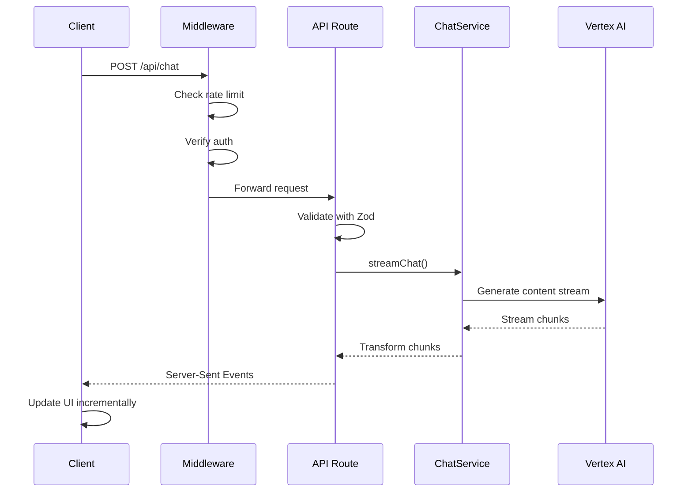
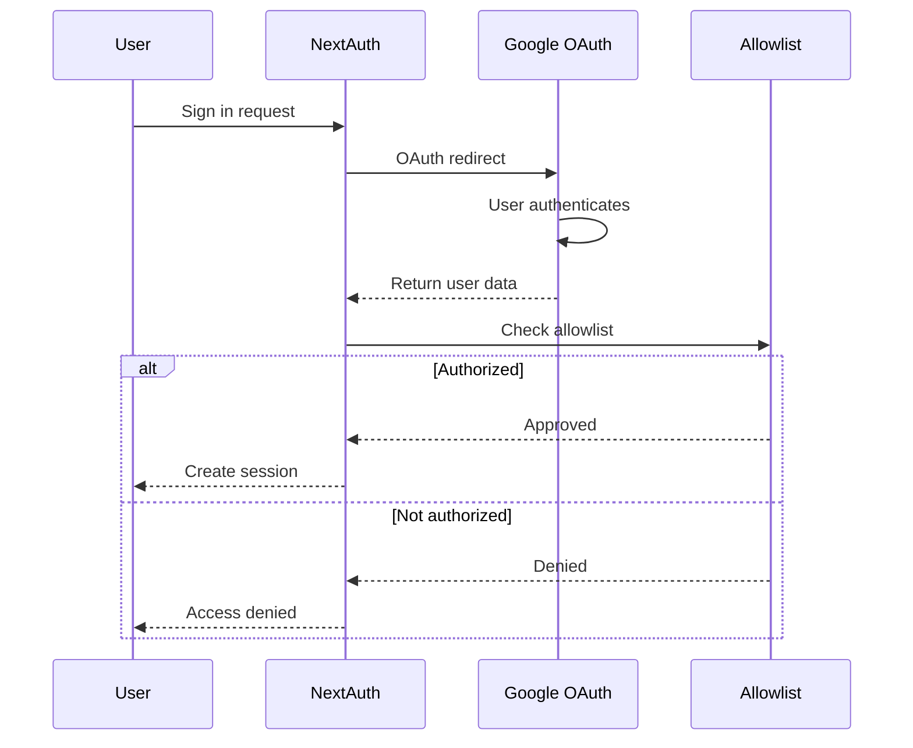
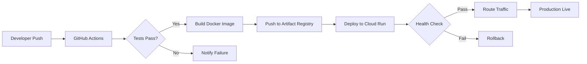
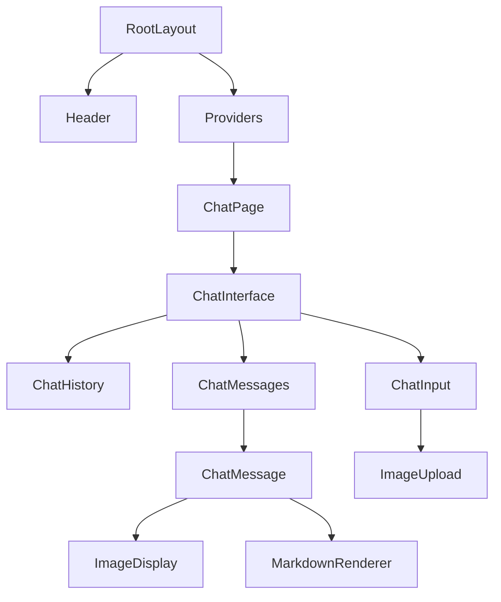

# Architecture Summary

## System Overview

This application is a **serverless, multimodal AI chat platform** built with modern web technologies and deployed on Google Cloud Run.

```
┌─────────────────────────────────────────────────────────────────┐
│                         Client Layer                             │
│  • React 19 (Server + Client Components)                        │
│  • Tailwind CSS 4 + shadcn/ui v4                                │
│  • Next.js App Router                                           │
└─────────────────┬───────────────────────────────────────────────┘
                  │
                  ├─ Static Pages (RSC)
                  ├─ Interactive Components (Client)
                  └─ API Routes
                  │
┌─────────────────▼───────────────────────────────────────────────┐
│                      Application Layer                           │
│  • Next.js 15 App Router                                        │
│  • Middleware (Auth, Rate Limit, Security)                      │
│  • API Routes (/api/*)                                          │
└─────────────────┬───────────────────────────────────────────────┘
                  │
                  ├─ Authentication (NextAuth.js)
                  ├─ Rate Limiting (rate-limiter-flexible)
                  ├─ Input Validation (Zod)
                  └─ Business Logic (Service Layer)
                  │
┌─────────────────▼───────────────────────────────────────────────┐
│                       Service Layer                              │
│  • ChatService (Vertex AI interaction)                          │
│  • Streaming utilities                                          │
│  • Error handling                                               │
└─────────────────┬───────────────────────────────────────────────┘
                  │
                  ├─ Chat streaming
                  ├─ Image generation
                  └─ Model selection
                  │
┌─────────────────▼───────────────────────────────────────────────┐
│                      External Services                           │
│  • Google Vertex AI (Gemini 2.5)                                │
│  • Google OAuth (NextAuth)                                      │
│  • Google Cloud Secret Manager                                  │
└─────────────────────────────────────────────────────────────────┘
```

## Core Principles

### 1. Server-First Architecture

- **React Server Components by default** - Client components only when necessary
- **Streaming responses** - Real-time AI responses via Server-Sent Events
- **Edge-ready middleware** - Security and rate limiting at the edge

### 2. Type Safety

- **TypeScript strict mode** throughout the codebase
- **Zod runtime validation** for external data
- **No `any` types** - Always use proper types or `unknown`

### 3. Security Layers

```
Request → Security Headers → Rate Limiting → Authentication → Authorization → Validation → Business Logic
```

### 4. Clean Code Structure

```
src/
├── app/              # Next.js App Router (routes & layouts)
│   ├── api/         # API route handlers
│   └── (routes)/    # Page components (Server Components)
│
├── components/       # React components
│   ├── ui/          # shadcn/ui primitives (atomic)
│   ├── chat/        # Feature-specific components
│   └── auth/        # Authentication components
│
├── lib/             # Core business logic
│   ├── services/    # Service layer (ChatService, etc.)
│   ├── hooks/       # Custom React hooks
│   ├── utils/       # Utility functions
│   ├── types/       # TypeScript types
│   ├── validation/  # Zod schemas
│   └── errors/      # Custom error classes
│
└── middleware/       # Edge middleware components
    ├── auth.ts      # Authentication middleware
    ├── rate-limit.ts # Rate limiting
    └── security.ts   # Security headers
```

## Request Flow

### Chat Request Flow



### Authentication Flow



### Deployment Flow



### Component Hierarchy



## Key Technologies

### Frontend

- **Next.js 15** - React framework with App Router
- **React 19** - UI library with Server Components
- **Tailwind CSS 4** - Utility-first styling
- **shadcn/ui v4** - Accessible component primitives

### Backend

- **Next.js API Routes** - Serverless functions
- **NextAuth.js** - Authentication (Google OAuth)
- **Zod** - Schema validation
- **rate-limiter-flexible** - Rate limiting

### AI & ML

- **Google Vertex AI** - Gemini 2.5 models
- **Streaming Protocol** - Server-Sent Events (SSE)
- **Multimodal Support** - Text + image inputs/outputs

### Infrastructure

- **Google Cloud Run** - Serverless container platform
- **Google Secret Manager** - Secure credential storage
- **Docker** - Container packaging

## Data Flow

### State Management

- **Server State** - Fetched data (React Server Components)
- **Client State** - UI state (React hooks: useState, useReducer)
- **Form State** - Form handling (React hook form patterns)
- **Session State** - Auth state (NextAuth session)

No global state management library (Redux, Zustand) needed - React 19 + RSC patterns suffice.

### Data Sources

1. **Google Vertex AI** - AI model responses
2. **NextAuth Session** - User authentication data
3. **Environment Variables** - Configuration (validated via Zod)

## Security Architecture

### Defense in Depth

```
1. Security Headers (CSP, HSTS, etc.)
   ↓
2. Rate Limiting (5 req/10s per IP)
   ↓
3. Authentication (OAuth + allowlist)
   ↓
4. Input Validation (Zod schemas)
   ↓
5. Secure Secrets (Cloud Secret Manager)
   ↓
6. Sanitized Outputs (XSS prevention)
```

### Authentication Layers

- **Google OAuth** (primary) - Invite-only allowlist
- **Test Credentials** (dev only) - bcrypt-hashed passwords
- **JWT Sessions** - Secure session tokens
- **HTTPS Only** - All traffic encrypted

## Deployment Architecture

```
┌─────────────────────────────────────────────────────────────┐
│                      GitHub Repository                       │
│                     (roofsonfire/chat)                       │
└────────────────────────┬────────────────────────────────────┘
                         │
                         │ Push to main branch
                         │
┌────────────────────────▼────────────────────────────────────┐
│                   GitHub Actions CI/CD                       │
│  • Run tests (Vitest)                                       │
│  • Build Docker image                                       │
│  • Push to Artifact Registry                                │
└────────────────────────┬────────────────────────────────────┘
                         │
                         │ Deploy via gcloud
                         │
┌────────────────────────▼────────────────────────────────────┐
│                   Google Cloud Run                           │
│                   (us-central1)                              │
│  • Serverless scaling (0-10 instances)                      │
│  • Custom domain: chat.daza.ar                              │
│  • Secrets from Secret Manager                              │
│  • 512MB memory, 1 vCPU per instance                        │
└─────────────────────────────────────────────────────────────┘
```

## Performance Characteristics

### Cold Start

- **First request**: ~2-3 seconds (container spin-up)
- **Warm requests**: <100ms response time
- **Scaling**: 0-10 instances based on traffic

### Optimization Strategies

1. **Server Components** - Reduce client-side JavaScript
2. **Streaming responses** - Incremental content delivery
3. **Code splitting** - Automatic with Next.js
4. **Image optimization** - Next.js Image component
5. **Turbopack** - Fast development builds

## Testing Strategy

### Test Pyramid

```
         ┌─────────────┐
         │   Manual    │  ← Smoke tests (tests/manual/)
         │   E2E       │
         └─────────────┘
       ┌───────────────────┐
       │   Integration     │  ← API + service integration
       └───────────────────┘
   ┌─────────────────────────────┐
   │        Unit Tests            │  ← Component + service units
   └─────────────────────────────┘
```

### Coverage Targets

- **Critical paths**: >90% coverage
- **Services**: >80% coverage
- **Components**: >70% coverage
- **Utils**: >85% coverage

## Scalability Considerations

### Current Limits

- **Max instances**: 10 (Cloud Run limit)
- **Rate limit**: 5 requests / 10 seconds per IP
- **Max request size**: 10MB (Cloud Run default)
- **Request timeout**: 300 seconds (long-running AI requests)

### Future Scale Points

- Add Redis for distributed rate limiting
- Implement message queue for async processing
- Add CDN for static assets
- Consider database for conversation history

## Development Workflow

```
Developer → Feature Branch → Local Testing → PR → Code Review
                                 ↓                      ↓
                           npm run test          CI Tests Pass
                                                        ↓
                                                 Merge to develop
                                                        ↓
                                                 Test on staging
                                                        ↓
                                                 Merge to main
                                                        ↓
                                                Deploy to production
```

## Related Patterns

- [API Route Pattern](api-route-pattern.md) - How to build API endpoints
- [Service Layer Pattern](service-layer-pattern.md) - Business logic structure
- [Error Handling Pattern](error-handling-pattern.md) - Error management
- [Testing Pattern](testing-pattern.md) - Test structure

## External References

- [Next.js App Router Docs](https://nextjs.org/docs/app)
- [React Server Components](https://react.dev/reference/rsc/server-components)
- [Google Vertex AI](https://cloud.google.com/vertex-ai/docs)
- [Google Cloud Run](https://cloud.google.com/run/docs)

---

**Last Updated:** November 2025  
**Maintained by:** Core Development Team
