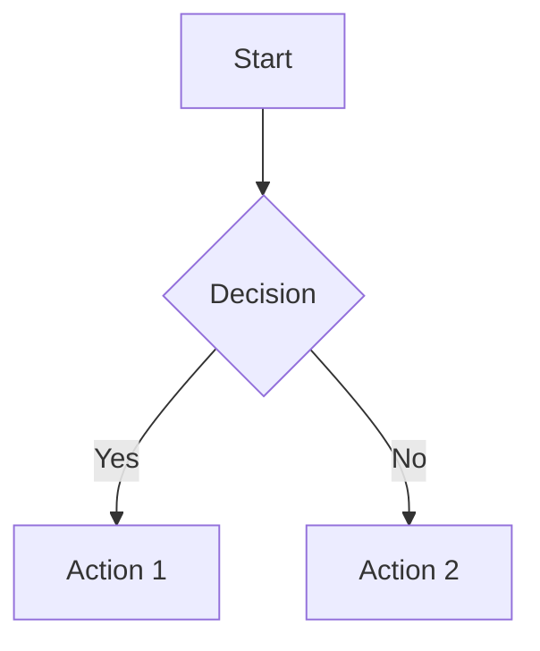

# MkDocs Documentation Site

This directory contains the MkDocs configuration and content for the project documentation site.

## 🌐 Live Site

**Production**: https://roofsonfire.github.io/chat/

## 🛠️ Local Development

### Prerequisites

```bash
pip install mkdocs-material
pip install mkdocs-mermaid2-plugin
pip install pymdown-extensions
```

### Serve Locally

```bash
# From project root
mkdocs serve

# Site will be available at http://127.0.0.1:8000
```

### Build

```bash
# Build static site
mkdocs build

# Output in ./site/
```

## 📁 Structure

```
docs/
├── index.md                    # Homepage
├── DEVELOPMENT.md              # Development guide
├── API.md                      # API reference
├── guides/                     # Guides and tutorials
├── deployment/                 # Deployment documentation
├── adr/                       # Architecture Decision Records
├── .github/patterns/          # Code patterns
├── security/                  # Security documentation
├── stylesheets/               # Custom CSS
│   └── extra.css
└── javascripts/               # Custom JavaScript
    └── extra.js
```

## ✨ Features

### Theme Features

- **Material for MkDocs** - Modern, responsive theme
- **Dark Mode** - Automatic theme switching
- **Search** - Full-text search with suggestions
- **Navigation** - Tabs, sections, instant navigation
- **Code Highlighting** - Syntax highlighting for 200+ languages
- **Mermaid Diagrams** - Interactive diagrams
- **Mobile-Friendly** - Responsive on all devices

### Custom Features

- **Copy Code Blocks** - One-click code copying
- **Anchor Links** - Direct links to headings
- **External Link Icons** - Visual indicators for external links
- **Smooth Scrolling** - Better navigation experience
- **Keyboard Shortcuts**:
  - `s` or `/` - Focus search
- **Version Warnings** - Alerts for outdated documentation

## 🚀 Deployment

### Automatic Deployment

Documentation is automatically deployed to GitHub Pages on every push to `main` that modifies:

- `docs/**` (any documentation files)
- `mkdocs.yml` (configuration)
- `.github/workflows/deploy-docs.yml` (deployment workflow)

### Manual Deployment

```bash
# Deploy to GitHub Pages
mkdocs gh-deploy

# With custom message
mkdocs gh-deploy -m "Update documentation"
```

## 📝 Writing Documentation

### Adding a New Page

1. Create a Markdown file in the appropriate directory:

```bash
touch docs/guides/my-new-guide.md
```

2. Add to `mkdocs.yml` navigation:

```yaml
nav:
  - Guides:
      - My New Guide: guides/my-new-guide.md
```

### Using Mermaid Diagrams

````markdown

````

### Adding Admonitions

```markdown
!!! note "Optional Title"
    This is a note admonition.

!!! warning
    This is a warning.

!!! tip
    This is a helpful tip.

!!! danger
    This is a danger warning.
```

### Code Blocks with Highlighting

````markdown
```typescript title="example.ts" linenums="1" hl_lines="2 3"
function greet(name: string): string {
  const message = `Hello, ${name}!`;
  return message;
}
```
````

### Using Tabs

```markdown
=== "TypeScript"
    ```typescript
    const x: number = 42;
    ```

=== "JavaScript"
    ```javascript
    const x = 42;
    ```
```

### Adding Cards (Grid Layout)

```markdown
<div class="grid cards" markdown>

- :material-icon:{ .lg .middle } **Title**

    ---

    Description here

    [:octicons-arrow-right-24: Link](path/to/page.md)

</div>
```

## 🎨 Customization

### Custom CSS

Edit `docs/stylesheets/extra.css` to add custom styles.

### Custom JavaScript

Edit `docs/javascripts/extra.js` to add custom functionality.

### Theme Colors

Modify `mkdocs.yml`:

```yaml
theme:
  palette:
    primary: indigo  # Change primary color
    accent: pink     # Change accent color
```

## 🔍 Search Configuration

Search is powered by lunr.js and configured in `mkdocs.yml`:

```yaml
plugins:
  - search:
      lang: en
      separator: '[\s\-\.]+'
```

## 📊 Analytics

Add Google Analytics in `mkdocs.yml`:

```yaml
extra:
  analytics:
    provider: google
    property: G-XXXXXXXXXX  # Your GA4 property ID
```

## 🐛 Troubleshooting

### Build Errors

```bash
# Strict mode catches errors
mkdocs build --strict

# Verbose output
mkdocs build --verbose
```

### Missing Dependencies

```bash
# Reinstall all dependencies
pip install -r requirements.txt

# Or manually
pip install mkdocs-material mkdocs-mermaid2-plugin pymdown-extensions
```

### Navigation Issues

Check `mkdocs.yml` for:

- Correct file paths (relative to `docs/`)
- Proper YAML indentation
- Valid Markdown files exist

### Mermaid Diagrams Not Rendering

Ensure plugin is installed and configured:

```bash
pip install mkdocs-mermaid2-plugin
```

```yaml
plugins:
  - mermaid2
```

## 📚 Resources

- [MkDocs Documentation](https://www.mkdocs.org/)
- [Material for MkDocs](https://squidfunk.github.io/mkdocs-material/)
- [PyMdown Extensions](https://facelessuser.github.io/pymdown-extensions/)
- [Mermaid.js](https://mermaid.js.org/)

## 🤝 Contributing

See [CONTRIBUTING-DOCS.md](CONTRIBUTING-DOCS.md) for documentation contribution guidelines.

---

**Last Updated**: November 2025  
**Maintained by**: Core Development Team
