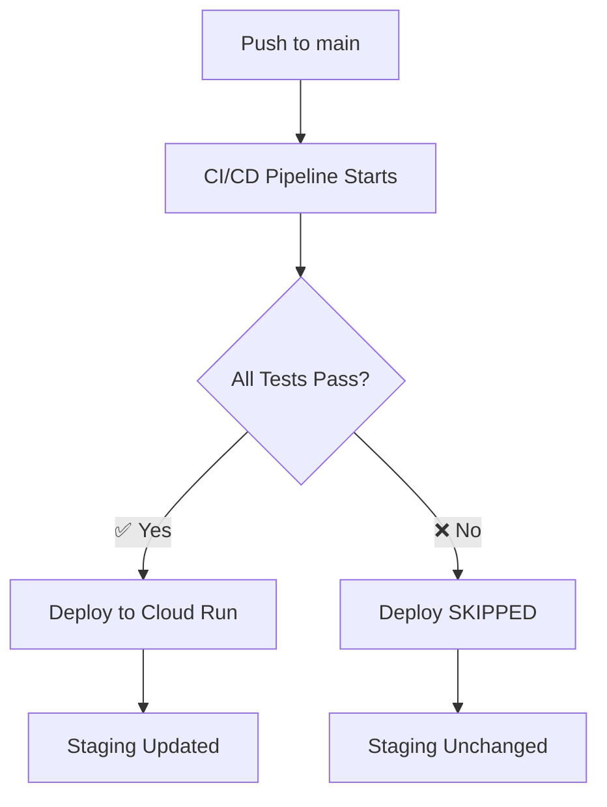

# ✅ GitHub Actions Workflows - Final Configuration

## 🎯 How It Works

### Workflow Execution Flow



### Workflow Dependencies

1. **CI/CD Pipeline** (`ci.yml`)
   - Trigger: Push to `main` or Pull Request
   - Jobs:
     - Lint and Type Check
     - Unit Tests
     - Build Check
   - Duration: ~3-15 minutes
   - **Must complete successfully before deployment**

2. **Deploy to Cloud Run** (`deploy-staging.yml`)
   - Trigger: **After CI/CD Pipeline completes successfully**
   - Alternative: Manual trigger via GitHub UI
   - Duration: ~2-3 minutes
   - **Only runs if CI passed**

## 🔒 Safety Features

### Prevents Broken Deployments

✅ **Deployment is SKIPPED if:**

- Any lint errors exist
- Any type check errors exist
- Any unit tests fail
- Build fails
- CI workflow times out (>15 min)

✅ **Deployment RUNS only if:**

- All tests pass ✅
- Linting passes ✅
- Type checking passes ✅
- Build succeeds ✅
- OR manually triggered

### Example Scenarios

#### Scenario 1: All Tests Pass ✅

```
Push to main → CI runs → All tests pass → Deploy runs → ✅ Staged
```

#### Scenario 2: Tests Fail ❌

```
Push to main → CI runs → Tests fail → Deploy SKIPPED → ⏸️ No changes
```

#### Scenario 3: Manual Deploy 🎯

```
Click "Run workflow" → Deploy runs immediately → ✅ Staged
(Bypasses CI - use with caution!)
```

## 📊 Current Status

### Latest Workflow Results

**CI/CD Pipeline:**

- Status: ❌ Failed (tests need fixing)
- Reason: Unit tests and lint failures
- Action: Fix tests before merging

**Deploy to Cloud Run:**

- Status: ⏭️ Skipped (correct behavior!)
- Reason: CI did not pass
- Result: Staging environment unchanged (safe!)

## 🔧 Configuration Details

### CI Workflow (`ci.yml`)

```yaml
on:
  push:
    branches: [main]
  pull_request:
    branches: [main]
```

- Runs on every push to `main`
- Runs on every pull request
- Independent workflow

### Deploy Workflow (`deploy-staging.yml`)

```yaml
on:
  workflow_run:
    workflows: ["CI/CD Pipeline"]
    types: [completed]
    branches: [main]
  workflow_dispatch:

jobs:
  deploy:
    if: ${{ github.event.workflow_run.conclusion == 'success' || github.event_name == 'workflow_dispatch' }}
```

- Triggers **after** CI/CD Pipeline completes
- Only deploys if CI conclusion is 'success'
- Can be manually triggered (bypasses CI check)

## 🎮 Manual Operations

### Trigger Deployment Manually

If you need to deploy without waiting for CI:

```bash
# Using GitHub CLI
gh workflow run deploy-staging.yml

# Or via GitHub UI:
# https://github.com/roofsonfire/chat/actions/workflows/deploy-staging.yml
# Click "Run workflow"
```

⚠️ **Warning**: Manual deployment bypasses CI checks. Use only when:

- CI is broken but code is known to be good
- Emergency hotfix needed
- Testing deployment process

### Monitor Workflows

```bash
# List recent runs
gh run list --limit 10

# Watch specific workflow
gh run watch <RUN_ID>

# View logs
gh run view <RUN_ID> --log

# Check deploy skipped reason
gh run view <RUN_ID> --json conclusion,status
```

## 🐛 Troubleshooting

### Deploy Not Running After CI Passes

**Check:**

1. Did CI actually pass? (all jobs green)
2. Was it on `main` branch?
3. Check deploy workflow logs for skip reason

```bash
gh run list --workflow="deploy-staging.yml" --limit 5
gh run view <DEPLOY_ID> --json conclusion,status,event
```

### Deploy Running When It Shouldn't

**Possible causes:**

- Manual trigger was used
- Conditional logic error in workflow

**Fix:**
Review the `if` condition in deploy job

### CI Passing But No Deploy

**Possible cause:**
Workflow might be skipped due to conclusion mismatch

**Debug:**

```bash
# Check CI conclusion
gh run view <CI_ID> --json conclusion
# Should be "success" not "skipped" or "cancelled"
```

## 📝 Best Practices

### For Development

1. **Always run tests locally before pushing**

   ```bash
   npm test -- --run
   npm run lint
   npx tsc --noEmit
   ```

2. **Use feature branches and PRs**
   - CI runs on PRs too
   - Catch issues before merging to main

3. **Check CI status before expecting deployment**

   ```bash
   gh run list --branch=main --limit 5
   ```

### For Deployment

1. **Let CI finish before manual deploy**
   - Wait for CI to complete
   - Review test results
   - Only then manually deploy if needed

2. **Monitor deployment**

   ```bash
   # Check deployment succeeded
   gcloud run services describe chat-staging --region=us-central1

   # Test service
   curl -I https://chat-staging-v2xv6gugxa-uc.a.run.app
   ```

3. **Verify after deployment**
   - Check service is responding
   - Test critical features
   - Monitor logs for errors

## 🎯 Next Steps to Fix CI

Based on latest failure, fix these issues:

1. **Unit Test Failures**

   ```bash
   npm test -- --run
   # Fix any failures shown
   ```

2. **Lint Issues**

   ```bash
   npm run lint
   # Fix all lint errors
   ```

3. **Type Check**

   ```bash
   npx tsc --noEmit
   # Fix all type errors
   ```

Once all fixed:

```bash
git add .
git commit -m "fix: resolve CI failures"
git push origin main
```

Then:

- CI will run and pass ✅
- Deploy will trigger automatically ✅
- Staging will be updated ✅

## ✅ Success Checklist

- [x] CI workflow configured
- [x] Deploy workflow configured
- [x] Deploy depends on CI success
- [x] Manual deploy option available
- [x] Proper checkout of correct commit
- [x] Deploy skips when CI fails
- [ ] All CI tests passing (in progress)
- [ ] Successful automatic deployment (waiting for CI fix)

---

**Status**: Workflows configured correctly ✅
**Action Required**: Fix CI test failures
**Safety**: Deployment protection working as expected ✅

**Last Updated**: October 6, 2025
**Commit**: e1159a9
