# Architecture Diagrams

Visual representation of the system architecture, flows, and components.

## System Architecture

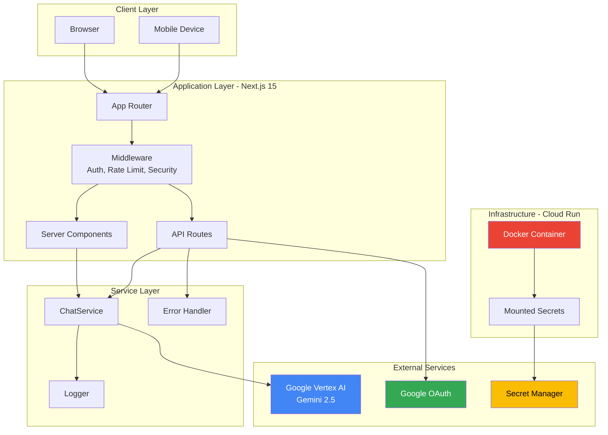

## Authentication Flow

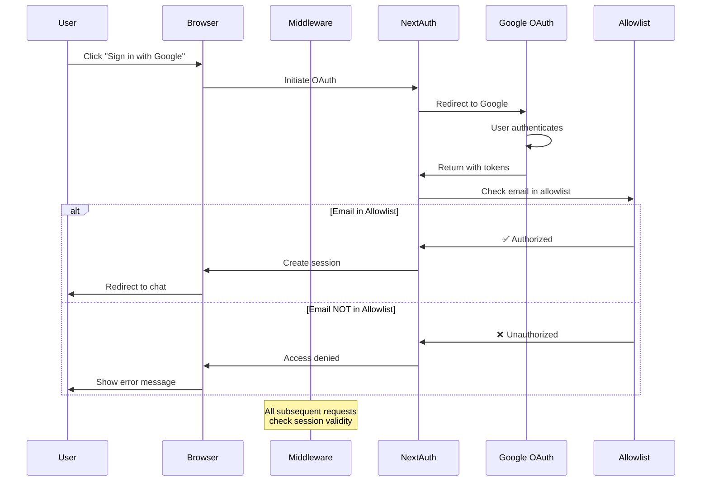

## Chat Request Flow

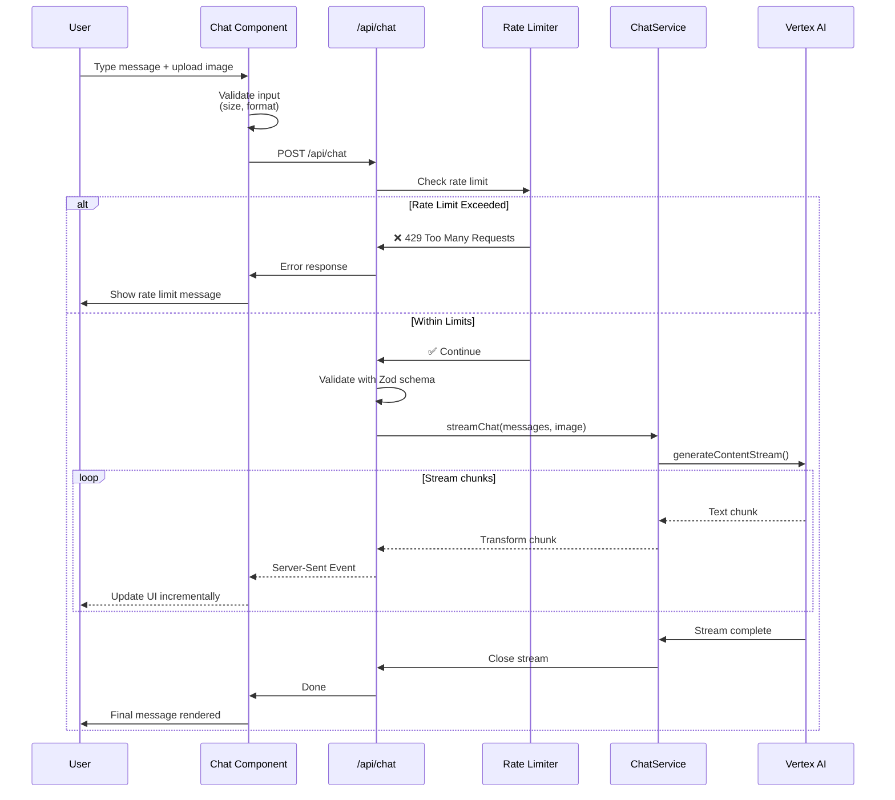

## Error Handling Flow

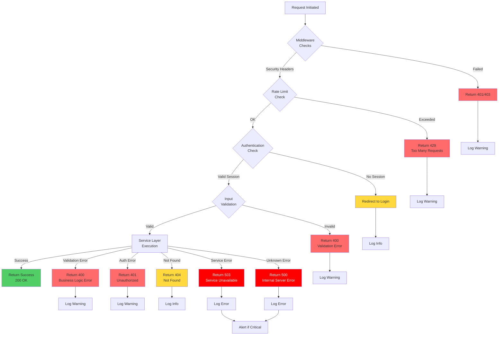

## Deployment Pipeline

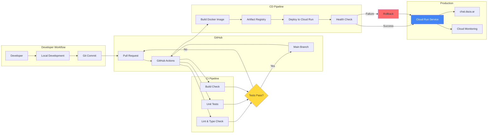

## Data Flow Diagram

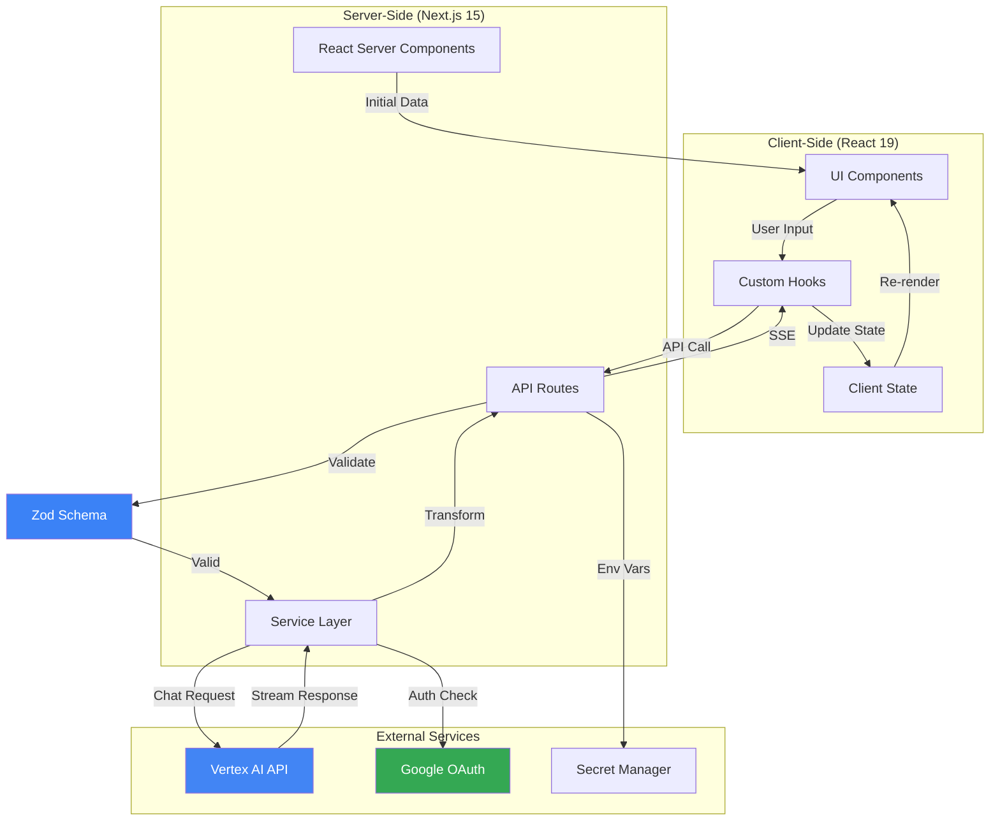

## Component Hierarchy

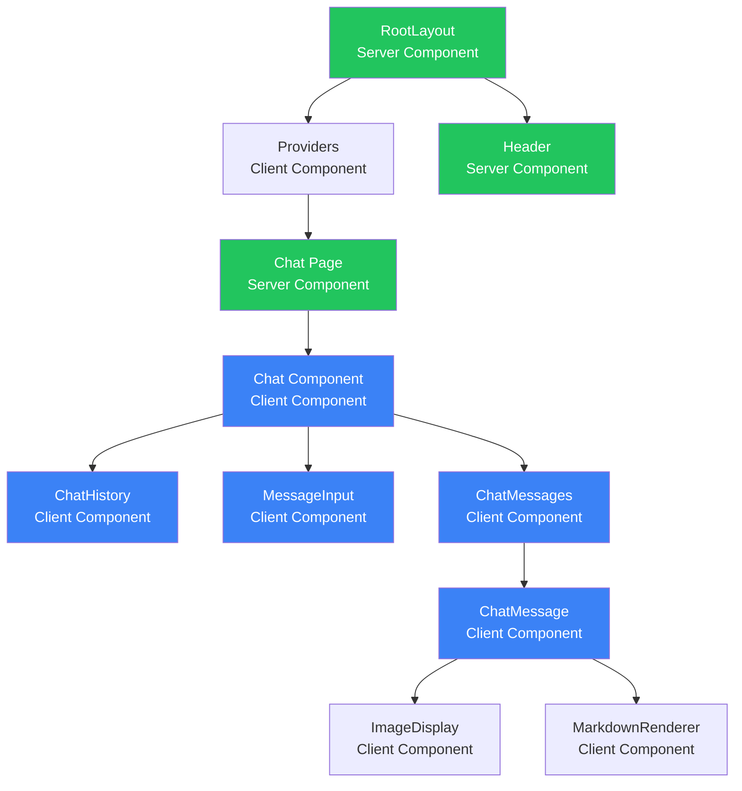

## Rate Limiting Architecture

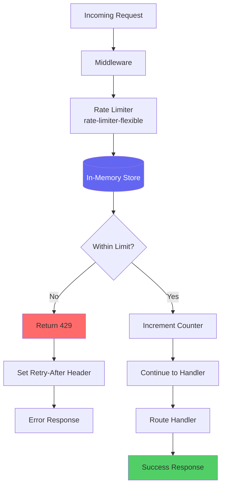

## Security Layers

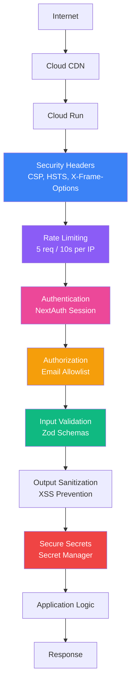

## Model Selection Flow

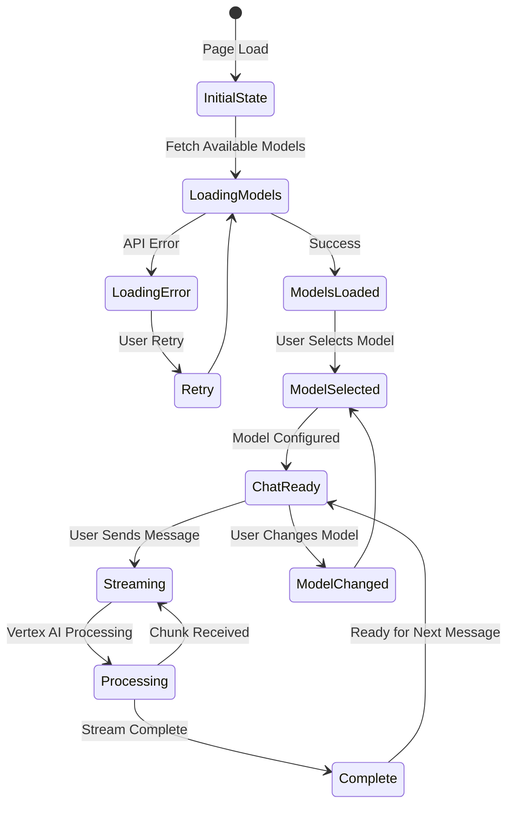

## Image Upload Flow

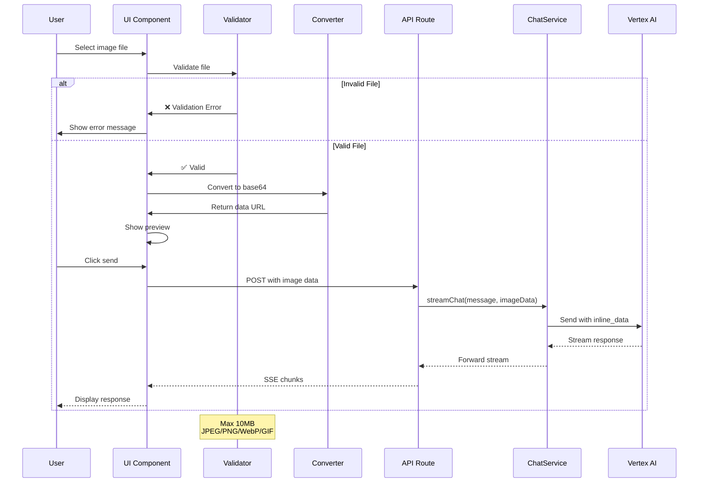

---

## Diagram Legend

- **Green boxes**: Server Components (rendered on server)
- **Blue boxes**: Client Components (interactive, browser)
- **Red boxes**: Error states
- **Yellow boxes**: Decision points or warnings

## Related Documentation

- [Architecture Summary](../.github/patterns/architecture-summary.md) - Detailed text description
- [API Documentation](../API.md) - API endpoint specifications
- [Deployment Guide](../deployment/DEPLOY.md) - Deployment process details

---

**Last Updated:** November 2025
**Maintained by:** Core Development Team
