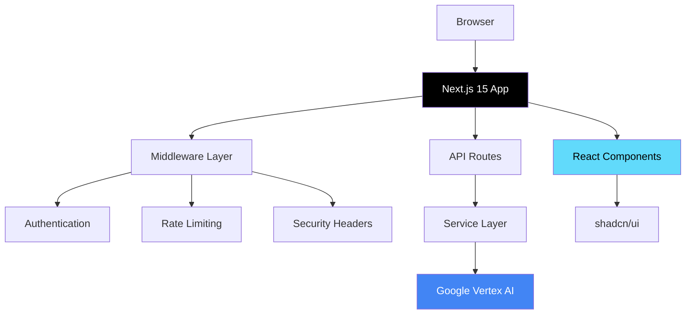

# Chat Application Documentation

Welcome to the comprehensive documentation for our production-grade AI chat application.

## 🚀 Quick Links

<div class="grid cards" markdown>

-   :material-clock-fast:{ .lg .middle } __Quick Start__

    ---

    Get up and running in 5 minutes

    [:octicons-arrow-right-24: Quick Start Guide](guides/QUICKSTART.md)

-   :material-book-open-variant:{ .lg .middle } __Development Guide__

    ---

    Complete development setup and workflows

    [:octicons-arrow-right-24: Development](DEVELOPMENT.md)

-   :material-api:{ .lg .middle } __API Reference__

    ---

    HTTP and streaming endpoints

    [:octicons-arrow-right-24: API Docs](API.md)

-   :material-rocket-launch:{ .lg .middle } __Deployment__

    ---

    Deploy to Google Cloud Run

    [:octicons-arrow-right-24: Deploy](deployment/DEPLOY.md)

</div>

## 📖 About This Project

This is a **production-grade AI chat application** built with:

- **Next.js 15** with App Router and Turbopack
- **React 19** with Server Components
- **TypeScript 5** in strict mode
- **Google Vertex AI** (Gemini 2.5 models)
- **Tailwind CSS 4** with shadcn/ui v4
- **NextAuth.js** for authentication

### Key Features

✅ **Real-time AI Chat** - Streaming responses with multimodal support (text + images)  
✅ **Server-First Architecture** - React Server Components by default  
✅ **Type-Safe** - TypeScript strict mode + Zod runtime validation  
✅ **Secure** - OAuth, rate limiting, input validation, security headers  
✅ **Production-Ready** - Deployed on Google Cloud Run with CI/CD  
✅ **Well-Documented** - Comprehensive docs, JSDoc, and code patterns

## 🏗️ Architecture Overview



[:octicons-arrow-right-24: Detailed Architecture](guides/ARCHITECTURE-DIAGRAMS.md)

## 🎯 Getting Started Paths

### For New Developers

1. **[Quick Start](guides/QUICKSTART.md)** - 5-minute setup guide
2. **[Development Guide](DEVELOPMENT.md)** - Comprehensive setup
3. **[Editor Setup](EDITOR-SETUP.md)** - VS Code/Zed configuration
4. **[Project Navigation](PROJECT-NAVIGATION.md)** - Find your way around

### For Contributors

1. **[Contributing Guidelines](CONTRIBUTING.md)** - How to contribute
2. **[Code Patterns](.github/patterns/architecture-summary.md)** - Coding standards
3. **[Common Mistakes](guides/COMMON-MISTAKES.md)** - Avoid pitfalls
4. **[Testing Guide](../tests/README.md)** - Test structure

### For DevOps/Deployment

1. **[Deployment Overview](deployment/DEPLOY.md)** - Getting started
2. **[Cloud Run Deployment](deployment/CLOUD-RUN-DEPLOYMENT.md)** - Step-by-step
3. **[GitHub Actions](deployment/GITHUB-ACTIONS-SETUP.md)** - CI/CD setup
4. **[Security](SECURITY.md)** - Security practices

## 📚 Documentation Structure

```
docs/
├── guides/               # How-to guides and tutorials
├── adr/                  # Architecture Decision Records
├── deployment/           # Deployment guides
├── security/             # Security documentation
├── features/             # Feature-specific docs
└── .github/patterns/     # Code patterns and examples
```

## 🔑 Key Concepts

### Server Components vs Client Components

This app uses **React Server Components (RSC)** by default:

- ✅ **Server Components** - Default, no `"use client"` needed
- 🔵 **Client Components** - Add `"use client"` when you need interactivity

[:octicons-arrow-right-24: Server Component Pattern](.github/patterns/server-component-pattern.md)

### Service Layer Pattern

Business logic lives in dedicated service classes:

```typescript
export class ChatService {
  async streamChat(messages: Message[]): Promise<ReadableStream> {
    // Business logic here
  }
}
```

[:octicons-arrow-right-24: Service Layer Pattern](.github/patterns/service-layer-pattern.md)

### Input Validation

All external data is validated with Zod schemas:

```typescript
const schema = z.object({
  messages: z.array(messageSchema),
  model: z.string().optional(),
});

const validated = schema.parse(body);
```

[:octicons-arrow-right-24: Validation Pattern](.github/patterns/validation-pattern.md)

## 🛡️ Security

Security is built-in with multiple layers:

1. **Security Headers** - CSP, HSTS, X-Frame-Options
2. **Rate Limiting** - 5 requests / 10 seconds per IP
3. **Authentication** - Google OAuth + email allowlist
4. **Input Validation** - Zod schemas for all inputs
5. **Secure Secrets** - Google Secret Manager

[:octicons-arrow-right-24: Security Documentation](SECURITY.md)

## 🚀 Tech Stack

| Category        | Technology                     | Version  |
| --------------- | ------------------------------ | -------- |
| **Framework**   | Next.js                        | 15.5.4   |
| **UI Library**  | React                          | 19.1.0   |
| **Language**    | TypeScript                     | 5.x      |
| **Styling**     | Tailwind CSS                   | 4.x      |
| **Components**  | shadcn/ui                      | v4       |
| **AI**          | Google Vertex AI               | Gemini 2.5 |
| **Auth**        | NextAuth.js                    | 4.24.11  |
| **Validation**  | Zod                            | 4.1.12   |
| **Testing**     | Vitest                         | 3.2.4    |
| **Platform**    | Google Cloud Run               | -        |

## 📊 Project Status

- **Production**: [chat.daza.ar](https://chat.daza.ar)
- **Repository**: [github.com/roofsonfire/chat](https://github.com/roofsonfire/chat)
- **Status**: ✅ Active development
- **License**: MIT

[:octicons-arrow-right-24: Detailed Project Status](PROJECT-STATUS.md)

## 🤝 Contributing

We welcome contributions! Please see our [Contributing Guidelines](CONTRIBUTING.md).

### Quick Contribution Steps

1. Fork the repository
2. Create a feature branch
3. Make your changes
4. Write tests
5. Submit a pull request

[:octicons-arrow-right-24: Full Contributing Guide](CONTRIBUTING.md)

## 📝 Documentation Standards

This documentation follows these principles:

- **Searchable** - Full-text search enabled
- **Visual** - Diagrams and screenshots where helpful
- **Practical** - Real code examples
- **Up-to-date** - Maintained with the codebase
- **AI-friendly** - Optimized for GitHub Copilot context

[:octicons-arrow-right-24: Documentation Guidelines](CONTRIBUTING-DOCS.md)

## 🔗 External Resources

- [Next.js 15 Documentation](https://nextjs.org/docs)
- [React 19 Documentation](https://react.dev)
- [shadcn/ui Components](https://ui.shadcn.com/)
- [Google Vertex AI Documentation](https://cloud.google.com/vertex-ai/docs)
- [Tailwind CSS Documentation](https://tailwindcss.com/)

---

**Last Updated:** November 2025  
**Maintained by:** Core Development Team  
**Questions?** Open an issue on [GitHub](https://github.com/roofsonfire/chat/issues)
