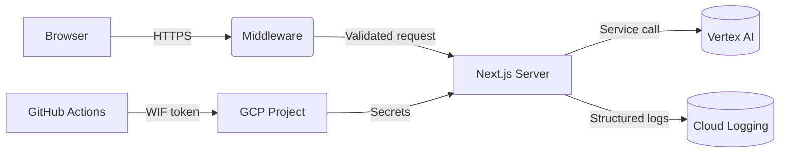

# Threat Model – November 2025

## Context

- **System:** AI Chat Assistant (Next.js 15, React 19, Vertex AI)
- **Deployment:** Google Cloud Run (us-central1), Workload Identity Federation for CI/CD
- **Authentication:** NextAuth (Google OAuth + restricted credentials provider)
- **Data sensitivity:** Authentication metadata, user prompts, AI responses (possible confidential data), OAuth tokens

## Assets

| Asset                      | Description                                             | Classification | Notes                                              |
| -------------------------- | ------------------------------------------------------- | -------------- | -------------------------------------------------- |
| Authentication secrets     | NEXTAUTH_SECRET, Google OAuth credentials, session JWTs | High           | Stored in Secret Manager, surfaced via runtime env |
| User prompts & attachments | Text prompts, optional base64 images                    | Medium         | Potentially sensitive business or personal data    |
| Vertex AI access           | GCP service account credentials (WIF)                   | High           | Controls model invocation and billing              |
| Deployment pipeline        | GitHub Actions workflows                                | High           | Compromised pipeline enables supply-chain attacks  |
| Logs & metrics             | Sanitized JSON logs, Cloud Logging sink                 | Medium         | Contains operational metadata, redacted secrets    |
| Rate limiter state         | In-memory counts per IP/request class                   | Medium         | Target for DoS evasion                             |

## Trust Boundaries

1. **Client ↔ Application:** Users interact via browser; CSP and CSRF enforce boundary.
2. **Application ↔ Vertex AI:** Server-side calls using service account; responses streamed to client.
3. **CI/CD ↔ GCP:** Workload Identity Federation issues short-lived credentials.
4. **Application ↔ Secret Manager:** Accessed during startup for secrets.
5. **Application ↔ Log Sink:** Structured logs exported to Cloud Logging/SIEM.

## Data Flow Overview

## Threats & Mitigations

| ID  | Threat                        | Vector                                      | Impact                              | Likelihood | Mitigation                                                       | Residual Risk                      |
| --- | ----------------------------- | ------------------------------------------- | ----------------------------------- | ---------- | ---------------------------------------------------------------- | ---------------------------------- |
| T1  | XSS via inline scripts        | Injected content or dependencies            | Session hijack, data theft          | Medium     | Nonce-based CSP, React sanitization, Markdown rendering controls | Low                                |
| T2  | Credential leakage in logs    | Verbose logging, error dumps                | Lateral movement, secret compromise | Medium     | Centralized logger redaction, unit tests                         | Low                                |
| T3  | Rate limit bypass             | Spoofed headers, distributed traffic        | DoS or brute-force                  | Medium     | Trusted proxy normalization, per-route limits, monitoring        | Medium (shared store pending)      |
| T4  | OAuth token theft             | Misconfigured callback, MITM                | Account takeover                    | Low        | Strict redirect URIs, HTTPS enforcement, state checks            | Low                                |
| T5  | Supply-chain attack           | Unpinned actions, compromised CI secrets    | Full compromise                     | Medium     | Pinned GH actions, WIF, actionlint guard, Docker digest locking  | Low                                |
| T6  | Sensitive prompt exfiltration | Malicious admin or attacker with log access | Compliance breach                   | Medium     | Log scrubbing, least-privilege IAM, retention policy             | Medium (runbook execution pending) |
| T7  | Vertex AI abuse               | Excessive usage via leaked creds            | Cost, data leakage                  | Low        | WIF with limited scopes, audit logs, upcoming rate monitoring    | Low                                |
| T8  | Image payload DoS             | Oversized base64 images                     | Memory exhaustion                   | Medium     | Schema size caps, request limit, unit tests                      | Low                                |
| T9  | Session fixation              | Reuse of JWT tokens                         | Unauthorized access                 | Low        | NextAuth JWT rotation, short session maxAge, CSRF protections    | Low                                |
| T10 | Unauthorized deployment       | Compromised GitHub repo                     | Backdoor release                    | Medium     | Branch protections, WIF, review workflow                         | Medium (monitoring alerts planned) |

## Tabletop Exercise Plan (Q1 2026)

- **Scenario:** Compromised GitHub Actions workflow pushing malicious image.
- **Objectives:** Validate alerting, incident response roles, rollback procedures.
- **Participants:** Engineering lead, security officer, DevOps, on-call engineer.
- **Artifacts:** Attack timeline, containment checklist, communication template.

## Action Items

1. Execute logging runbook: create retention buckets, CMEK, alert policies; document evidence.
2. Instrument rate limiter metrics for shared store migration (Redis/Cloud Armor evaluation).
3. Configure Cloud Asset Inventory/Threat Detection for WIF usage anomalies.
4. Schedule tabletop session (Jan 2026) and capture outcomes in `docs/security/TABLETOP-REPORT.md`.
5. Monitor CSP report-only mode (optional) to gather violation data before enforcing additional sources.

## Residual Risks Summary

- **Rate limiting persistence:** Current in-memory implementation per instance; distributed cache pending.
- **Logging retention:** Runbook defined but not executed; risk of insufficient audit trails.
- **Incident readiness:** Tabletop exercise outstanding; response process theoretical.

## References

- `src/middleware/security.ts` – CSP configuration
- `src/middleware/rate-limit.ts` – Rate limiting logic
- `docs/security/LOGGING-RUNBOOK.md` – Logging retention procedures
- `SECURITY-AUDIT.md` – Comprehensive assessment and remediation tracker
