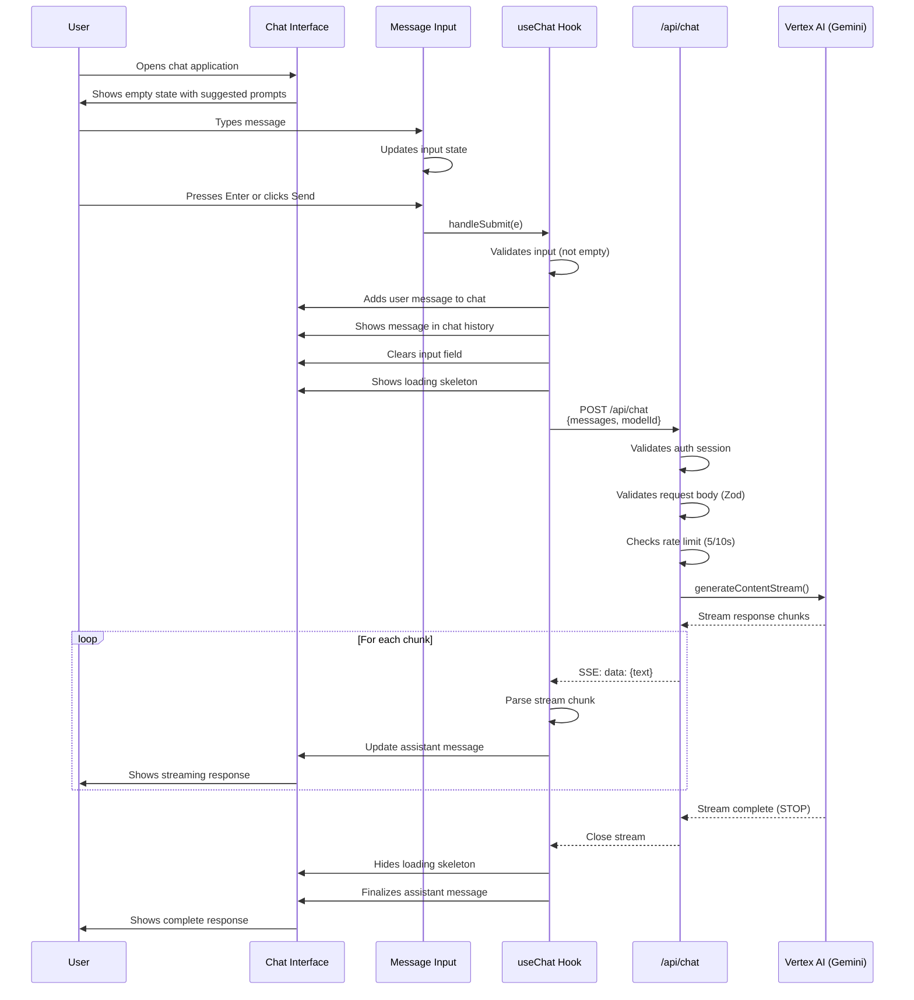
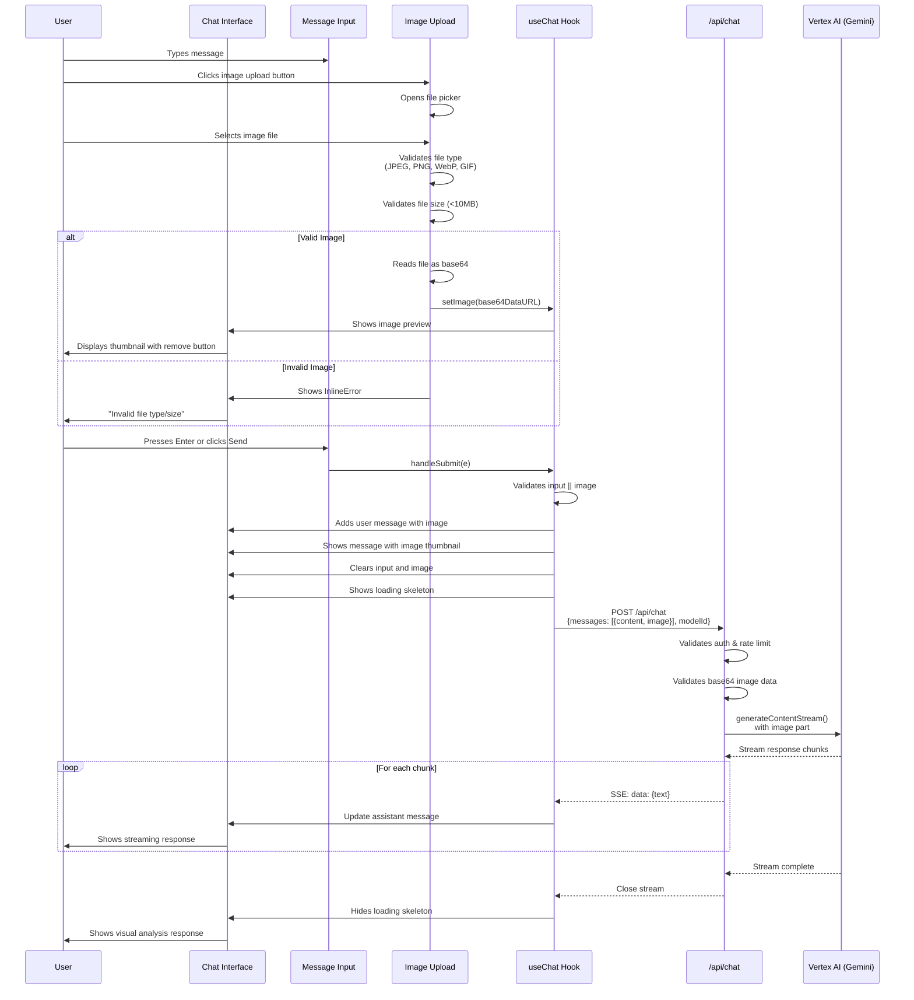
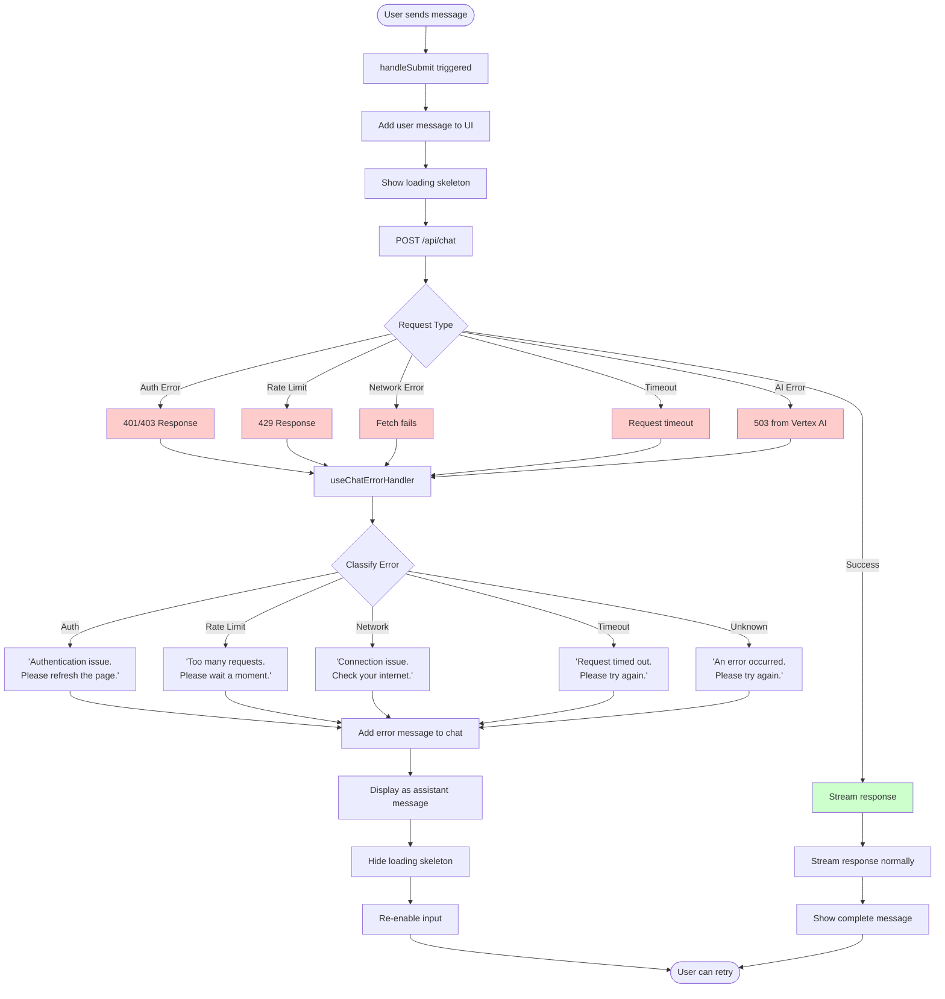
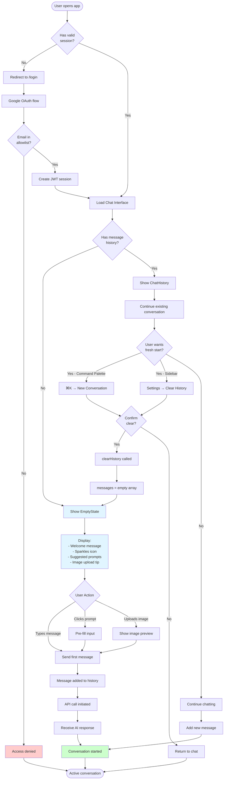

# User Flows Documentation

This document defines and maps the core user flows for the AI Chat Assistant application.

## Overview

The application provides an AI-powered chat interface with multimodal support (text + images). Users can have conversations with Google's Gemini AI models through a clean, intuitive interface.

## Table of Contents

1. [Happy Path: Send Text Message](#1-happy-path-send-text-message)
2. [Happy Path: Send Message with Image](#2-happy-path-send-message-with-image)
3. [Error Handling: API Error Flow](#3-error-handling-api-error-flow)
4. [New Conversation Flow](#4-new-conversation-flow)

---

## 1. Happy Path: Send Text Message

### User Story

As a user, I want to send a text message to the AI assistant and receive a response.

### Flow Diagram



### Steps

1. **Initial State**
   - User lands on chat interface
   - Empty state displayed with suggested prompts
   - Input field is focused and ready

2. **Message Input**
   - User types message in textarea
   - Character count updates (if implemented)
   - Send button becomes enabled

3. **Message Submission**
   - User presses `Ctrl+Enter` or clicks Send button
   - `handleSubmit()` is triggered
   - Input validation occurs (non-empty check)

4. **Optimistic UI Update**
   - User message immediately added to chat history
   - Input field cleared
   - Loading skeleton appears below last message
   - Input remains disabled during loading

5. **API Request**
   - `POST /api/chat` with messages array
   - Request includes selected model ID
   - Auth session verified
   - Rate limit checked

6. **Streaming Response**
   - Server-Sent Events (SSE) stream initiated
   - Each chunk parsed and text extracted
   - Assistant message updates in real-time
   - User sees response appear word-by-word

7. **Completion**
   - Stream closes when AI finishes
   - Loading skeleton removed
   - Complete message displayed
   - Input re-enabled for next message

### UI States

| State     | UI Elements                                 |
| --------- | ------------------------------------------- |
| Empty     | EmptyState component with suggested prompts |
| Ready     | Input enabled, Send button ready            |
| Typing    | Input updates, character count (optional)   |
| Sending   | Loading skeleton, input disabled            |
| Streaming | Text appears incrementally                  |
| Complete  | Full response visible, input re-enabled     |

---

## 2. Happy Path: Send Message with Image

### User Story

As a user, I want to send an image along with text to get visual analysis from the AI.

### Flow Diagram



### Steps

1. **Image Selection**
   - User clicks image upload button (📎 icon)
   - File picker opens (accept: image/\*)
   - User selects image file

2. **Image Validation**
   - Client-side validation:
     - File type: JPEG, PNG, WebP, GIF
     - File size: < 10MB
   - If invalid, show InlineError with reason

3. **Image Preview**
   - Valid image converted to base64 data URL
   - Thumbnail preview shown in input area
   - Remove button (❌) available to clear image

4. **Message Submission**
   - User can send message with or without text
   - Validation: `input || image` must be truthy
   - Both text and image included in message object

5. **API Request**
   - Image sent as base64 in message object
   - Server validates image format
   - Vertex AI receives both text and image parts

6. **Response**
   - AI analyzes image content
   - Streams response with visual analysis
   - Same streaming UX as text-only messages

### Image Handling

```typescript
// Message structure with image
{
  role: "user",
  content: "What's in this image?",
  image: "data:image/jpeg;base64,/9j/4AAQSkZJRg...",
  timestamp: new Date()
}
```

### UI States

| State          | UI Elements                       |
| -------------- | --------------------------------- |
| No Image       | Upload button visible, no preview |
| Image Selected | Thumbnail preview, remove button  |
| Uploading      | Loading indicator (if async)      |
| Invalid        | InlineError with reason           |
| Sent           | Image thumbnail in message bubble |

---

## 3. Error Handling: API Error Flow

### User Story

As a user, when an error occurs, I want clear feedback and options to recover.

### Flow Diagram



### Error Types and Messages

| Error Type         | HTTP Code         | User Message                                                                                 | Recovery Action           |
| ------------------ | ----------------- | -------------------------------------------------------------------------------------------- | ------------------------- |
| **Authentication** | 401, 403          | "There appears to be an authentication issue. Please refresh the page and try again."        | Refresh page, re-login    |
| **Rate Limit**     | 429               | "I'm receiving too many requests right now. Please wait a moment and try again."             | Wait 10 seconds, retry    |
| **Network**        | N/A (fetch fails) | "There seems to be a connection issue. Please check your internet connection and try again." | Check connection, retry   |
| **Timeout**        | N/A (timeout)     | "The request timed out. Please try again."                                                   | Retry immediately         |
| **AI Service**     | 503               | "The AI service is temporarily unavailable. Please try again in a moment."                   | Wait, retry               |
| **Unknown**        | 500, others       | "Sorry, I encountered an error processing your request. Please try again."                   | Retry, report if persists |

### Error Handling Code Flow

```typescript
// In use-chat-error-handler.ts
try {
  const response = await sendChatRequest(messages, selectedModel);
  await parseStream(response, setMessages);
} catch (error) {
  handleChatError(error, setMessages);
  // Error message added to chat as assistant message
  // User can see error and continue conversation
} finally {
  setIsLoading(false); // Always re-enable input
}
```

### UI Error States

1. **Inline Error** (validation)
   - Used for client-side validation
   - Example: "Message cannot be empty"
   - Shown below input field

2. **Error Message** (API errors)
   - Added to chat as assistant message
   - Clearly indicates it's an error
   - Maintains conversation context

3. **ErrorState Component** (critical failures)
   - Full-page error for unrecoverable issues
   - Provides retry and go home options
   - Used for auth failures, critical bugs

### Recovery Options

- **Automatic**: Error added to chat, input re-enabled
- **Manual Retry**: User can retype/resend message
- **Refresh**: For auth issues (preserved in error message)
- **Wait**: For rate limits (timer could be added)

---

## 4. New Conversation Flow

### User Story

As a user, I want to start a fresh conversation without previous context.

### Flow Diagram



### Scenarios

#### Scenario A: First-Time User (No History)

1. **Authentication**
   - User opens application
   - Redirected to `/login` if no session
   - Google OAuth flow initiated
   - Email checked against allowlist
   - Session created if authorized

2. **Initial Load**
   - Chat interface loads
   - No messages in history
   - EmptyState component displayed

3. **EmptyState Features**
   - Welcoming heading: "Start a Conversation"
   - Friendly description
   - 4 suggested prompts:
     - "Explain quantum computing in simple terms"
     - "Write a creative story about a robot"
     - "Help me debug this TypeScript code"
     - "Suggest ideas for a mobile app"
   - Tip about image uploads

4. **First Interaction**
   - User types message or clicks suggested prompt
   - If prompt clicked, input field pre-filled
   - User sends message (Enter or Send button)
   - Empty state replaced with chat history
   - Conversation begins

#### Scenario B: Returning User (Has History)

1. **Load Existing Conversation**
   - User returns to application
   - Session cookie validates automatically
   - ChatHistory component loads
   - Previous messages displayed
   - Scroll positioned at bottom

2. **Continue Conversation**
   - User can immediately add new messages
   - Context from previous messages maintained
   - No interruption to flow

#### Scenario C: Start Fresh (Clear History)

1. **User Triggers Clear**
   - **Option 1**: Command Palette (`⌘K` or `Ctrl+K`)
     - Opens command dialog
     - User types or selects "New Conversation"
     - Confirmation dialog appears
   - **Option 2**: Sidebar Menu
     - Opens sidebar (hamburger or trigger)
     - Navigates to Settings → Chat Settings
     - Clicks "Clear History"
     - Confirmation dialog appears

2. **Confirmation Dialog**
   - AlertDialog component shown
   - Title: "Clear Chat History"
   - Description: "This action cannot be undone. This will permanently delete all messages in this conversation."
   - Actions:
     - "Cancel" button (returns to chat)
     - "Clear History" button (destructive variant)

3. **Clear Execution**
   - User confirms clear
   - `clearHistory()` called in useChat hook
   - Messages array set to empty: `setMessages([])`
   - Session storage cleared (if implemented)

4. **Return to Empty State**
   - Chat interface transitions to EmptyState
   - Suggested prompts reappear
   - User can start fresh conversation

### State Management

```typescript
// In use-chat-state.ts
const [messages, setMessages] = useState<Message[]>([]);

const clearHistory = () => {
  setMessages([]); // Reset to empty array
  // Optional: Clear from session storage
  // sessionStorage.removeItem('chat-messages');
};
```

### UI Transitions

| From    | To      | Trigger       | Transition                    |
| ------- | ------- | ------------- | ----------------------------- |
| Empty   | History | First message | EmptyState → ChatHistory      |
| History | Empty   | Clear history | Fade out → EmptyState fade in |
| Login   | Empty   | Auth success  | Redirect → EmptyState         |
| Login   | Login   | Auth fail     | Error message display         |

---

## Additional UX Patterns

### Loading States

- **Page Load**: Skeleton for entire chat interface
- **Message Send**: LoadingSkeleton for AI response
- **Model Switch**: Brief loading indicator
- **Image Upload**: Spinner during file read

### Keyboard Shortcuts

| Shortcut                 | Action               |
| ------------------------ | -------------------- |
| `Enter`                  | New line in message  |
| `Ctrl+Enter` / `⌘+Enter` | Send message         |
| `⌘K` / `Ctrl+K`          | Open command palette |
| `Esc`                    | Close dialogs/modals |

### Accessibility

- **Focus Management**: Input auto-focused on load/clear
- **Keyboard Navigation**: All actions accessible via keyboard
- **Screen Readers**: Proper ARIA labels on components
- **Loading Indicators**: Announce when message is being generated

### Mobile Considerations

- **Touch Targets**: Minimum 44x44px for buttons
- **Responsive Layout**: Sidebar collapses on mobile
- **Input Behavior**: Virtual keyboard doesn't obscure input
- **Image Upload**: Native file picker on mobile

---

## Implementation Status

### Completed ✅

- [x] Core chat messaging flow
- [x] Image upload and preview
- [x] Error handling system
- [x] Loading states (Issue #107)
- [x] Empty states (Issue #107)
- [x] Command palette
- [x] Clear history confirmation
- [x] Authentication flow

### In Progress 🚧

- [ ] User flow documentation (this document)

### Future Enhancements 🔮

- [ ] Conversation history persistence (database)
- [ ] Multiple conversation threads
- [ ] Message export formats (PDF, Markdown)
- [ ] Voice input support
- [ ] Code syntax highlighting in responses
- [ ] Citation links for AI responses

---

## References

### Related Documentation

- [API Documentation](../API.md) - Endpoint specifications
- [Error Handling Pattern](../.github/patterns/error-handling-pattern.md) - Error architecture
- [Component Documentation](../components/) - UI component specs

### Related Issues

- [Epic #105](https://github.com/roofsonfire/chat/issues/105) - UI/UX Refinement
- [Issue #107](https://github.com/roofsonfire/chat/issues/107) - Loading/Empty/Error States
- [Issue #108](https://github.com/roofsonfire/chat/issues/108) - Design Token System
- [Issue #109](https://github.com/roofsonfire/chat/issues/109) - 8pt Grid System
- [Issue #111](https://github.com/roofsonfire/chat/issues/111) - Theme Customization

### Tools Used

- **Mermaid**: Flow diagrams and sequence diagrams
- **Markdown**: Documentation format
- **GitHub Issues**: Requirements tracking

---

**Document Version**: 1.0  
**Last Updated**: November 12, 2025  
**Maintained By**: Core Development Team
